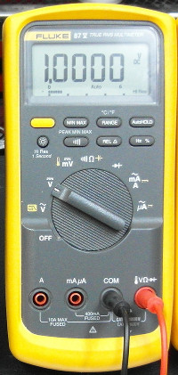
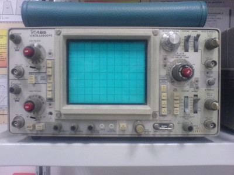

# Mittaustekniikka kevät 2016

Tällä kurssilla opimme mittaamaan elektroniikassa (ja sähköopissa) olennaisia suureita käyttäen erinäisiä mittalaitteita, sekä teoriaa kyseisten suureiden mittaamisen pohjalla. Huomaa, että käymme läpi vain pienen osan suureista ja mittaustavoista; esimerkiksi kompleksilukujen käyttöä vaihtovirtasuureiden mittauksessa ja mallinnuksessa ei käsitellä.

---

## Käytetyt mittalaitteet

**Yleismittari**

Yleismittarilla voi nimensä mukaisesti mitata montaa suuretta: virtaa, jännitettä ja resistanssia. Nämä ovat kolme sähköopin perussuuretta. Monella yleismittarilla voi lisäksi mitata mm. kapasitanssia, transistorin vahvistuskerrointa (hfe) ja lämpötilaa, mutta nämä lisäominaisuudet vaihtelevat yleismittarista toiseen. Yleismittariin voi liittää joko mittakoskettimet, tai muita laitteita, 4mm banaaniliittimillä.

---

**Oskilloskooppi**

Oskilloskooppi piirtää jännitteen muutokset näkyväksi kuvaputkelle. Sillä voi mitata tasajännitettä kuten yleismittarilla, mutta oikeuksiinsa oskilloskooppi pääsee muuttuvia jännitesignaaleita mitattaessa. Signaaleista mitattavia suureita ovat mm. taajuus, jaksonaika, amplitudi, tasavirtakomponentti (*DC bias*), kohina, särö, viive, vaihe-ero sekä nousu- ja laskuajat. Lisäksi oskilloskooppi näyttää signaalin aaltomuodon. Harjaantunut silmä voi lukea mm. digitaalisen signaalin aaltomuodosta sen sisältämää dataa. Oskilloskoopilla voi mitata sekä jatkuvia suureita että nopeita *transientteja*, mutta transienttien mittaamiseen tarvitaan muistioskilloskooppi. Yleismittariin kytketään mittapäät (*probes*) tai mitattava laite BNC-liittimillä.

---

**Funktiogeneraattori**

Funktiogeneraattori ei mittaa mitään, vaan tuottaa signaalia halutulla taajuudella, amplitudilla sekä aaltomuodolla. Aaltomuotoja on yleensä pieni, rajattu joukko: siniaalto, kanttiaalto, sahalaita-aalto ja kanttiaalto, joita voi lisäksi vääristää (*skew*). Funktiogeneraattorin voi kytkeä testattavaan piiriin tuloon (*input*), jolloin lähdöstä (*output*), voidaan mitata esimerkiksi amplitudivaste ja vaihevaste tietyillä taajuuksilla käyttäen oskilloskooppia (tämä on melko vaivalloista). Funktiogeneraattoria voi myös lisäksi käyttää digitaalisen piirin kellosignaalina, jollon piirin toimintaa voi testata eri kellotaajuuksilla. Sitä voi myös käyttää esimerkiksi testisignaalilähteenä kaiuttimien ääniominaisuuksien mittaamiseen. Kaiken kaikkiaan funktiogeneraattori on monipuolinen apuväline analogisten piirien mittaamiseen ja testaamiseen. Funktiogeneraattorissa on BNC-liittimet signaalilähdölle.

---

Oskilloskooppi: [Elborgo](https://en.wikipedia.org/wiki/Oscilloscope#/media/File:Tektronix_465_Oscilloscope.jpg)

Funktiogeneraattori: [QEDquid](https://en.wikipedia.org/wiki/Function_generator#/media/File:Kenwood_FG273_Function_Generator.jpg)