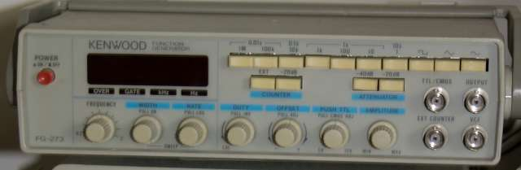

## Kurssin sisältö ja tavoitteet

Tällä kurssilla opimme mittaamaan elektroniikassa (ja sähköopissa) olennaisia suureita käyttäen erinäisiä mittalaitteita, sekä teoriaa kyseisten suureiden mittaamisen pohjalla. Huomaa, että käymme läpi vain pienen osan suureista ja mittaustavoista; esimerkiksi kompleksilukujen käyttöä vaihtovirtasuureiden mittauksessa ja mallinnuksessa ei käsitellä. Kurssin jälkeen osallistujan on tarkoitus osata mitata itsenäisesti kurssilla läpi käytyjä suureita.

## Miksi mittaustekniikka?

Mittaaminen on tylsää puuhaa, eikö1? Insinöörille mittalaitteet ovat kuitenkin silmien jatke &mdash; niillä sähköisen maailman ilmiöt saadaan näkyviksi ja havaittaviksi. Laitteiden rakentaminen ilman mittalaitteita on hankalaa, sillä tekemiään virheitä on vaikeaa (ellei mahdotonta) havaita, ja lopputuloksen näkee vasta, kun kytkee lopulliseen laitteen päälle. Sen sijaan mittalaitteilla voi testata joka ikisen komponentin ja moduulin, jollon voi luottavaisin mielin yhdistää ne kokonaisuudeksi.

---

## Käytetyt mittalaitteet

**Yleismittari**

Yleismittarilla voi nimensä mukaisesti mitata montaa suuretta: virtaa, jännitettä ja resistanssia. Nämä ovat kolme sähköopin perussuuretta. Monella yleismittarilla voi lisäksi mitata mm. kapasitanssia, transistorin vahvistuskerrointa (hfe) ja lämpötilaa, mutta nämä lisäominaisuudet vaihtelevat yleismittarista toiseen. Yleismittariin voi liittää joko mittakoskettimet, tai muita laitteita, 4mm banaaniliittimillä.

---

**Oskilloskooppi**

Oskilloskooppi piirtää jännitteen muutokset näkyväksi kuvaputkelle. Sillä voi mitata tasajännitettä kuten yleismittarilla, mutta oikeuksiinsa oskilloskooppi pääsee muuttuvia jännitesignaaleita mitattaessa. Signaaleista mitattavia suureita ovat mm. taajuus, jaksonaika, amplitudi, tasavirtakomponentti (*DC bias*), kohina, särö, viive, vaihe-ero sekä nousu- ja laskuajat. Lisäksi oskilloskooppi näyttää signaalin aaltomuodon. Harjaantunut silmä voi lukea mm. digitaalisen signaalin aaltomuodosta sen sisältämää dataa. Oskilloskoopilla voi mitata sekä jatkuvia suureita että nopeita *transientteja*, mutta transienttien mittaamiseen tarvitaan muistioskilloskooppi. Yleismittariin kytketään mittapäät (*probes*) tai mitattava laite BNC-liittimillä.

---

**Funktiogeneraattori**

Funktiogeneraattori ei mittaa mitään, vaan tuottaa signaalia halutulla taajuudella, amplitudilla sekä aaltomuodolla. Aaltomuotoja on yleensä pieni, rajattu joukko: siniaalto, kanttiaalto, sahalaita-aalto ja kanttiaalto, joita voi lisäksi vääristää (*skew*). Funktiogeneraattorin voi kytkeä testattavaan piiriin tuloon (*input*), jolloin lähdöstä (*output*), voidaan mitata esimerkiksi amplitudivaste ja vaihevaste tietyillä taajuuksilla käyttäen oskilloskooppia (tämä on melko vaivalloista). Funktiogeneraattoria voi myös lisäksi käyttää digitaalisen piirin kellosignaalina, jollon piirin toimintaa voi testata eri kellotaajuuksilla. Sitä voi myös käyttää esimerkiksi testisignaalilähteenä kaiuttimien ääniominaisuuksien mittaamiseen. Kaiken kaikkiaan funktiogeneraattori on monipuolinen apuväline analogisten piirien mittaamiseen ja testaamiseen. Funktiogeneraattorissa on BNC-liittimet signaalilähdöille.

---

**Taajuuslaskuri**

Taajuuslaskuri mittaa nimensä mukaisesti signaalin taajuutta. Jotkin taajuuslaskurit (pulssilaskurit) osaavat myös laskea pulssien lukumääriä. Taajuutta voi myös mitata oskilloskoopilla, mutta jos oskilloskoopin kanavat loppuvat, tai jos pitää mitata hyvin erisuuruisia taajuuksia, voi taajuuslaskureista olla hyötyä. Taajuuslaskurit ovat myös tarkempia ja halvempia kuin vastaavan taajuusalueen oskilloskoopit. Taajuuslaskurissa on yleensä BNC-liitin tulosignaalille.

---

**Spektrianalysaattori**

Spektrianalysaattoreita käytetään eri signaalien (radiosignaali, videosignaali, äänisignaali, datasignaali) tarkasteluun taajuustasossa, kun oskilloskoopilla tarkastellaan signaaleja aikatasossa. Sillä voi mitata mm. tehoja, taajuuksia, säröä ja kohinaa, myös radiosignaaleista joita on vaikeaa tarkastella oskilloskoopilla. Spektrianalysaattori näyttää signaalin jännitteen taajuuden funktiona. Joissain oskilloskoopeissa on FFT-toiminto, jolla voi myös tarkastella signaalia taajuustasossa, mutta varsinaisella spektrianalysaattorilla saadaan aikaan parempi erottelu sekä taajuusalue. Yleisin spektrianalysaattorityyppi, eli pyyhkäisyspektrianalysaattori, vaatii signaalin olevan jatkuvaa, joten transienttimittauksiin FFT sopii paremmin. Spektrianalysaattorissa on yleensä BNC-liitin tulosignaalille.

---

**Vektoripiirianalysaattori**

Lineaarisen kaksiporttipiirin käyttäytymisen voi kuvata yksiselitteisesti siirtofunktiolla, joka kuvaa piirin lähtösignaalin tulosignaalin funktiona. Vektoripiirianalysaattorilla siirtofunktion mittaaminen on helppoa: kytkee piirin lähdön ja tulon analysaattoriin ja käynnistää analyysin, jolloin siirtofunktio piirtyy amplitudi- ja vaihevastekäyrinä analysaattorin ruudulle. Näin piiriä on helppo verrata mm. teoreettiseen piiriin, ja sen käyttäytymistä laajemmissa kokonaisuuksissa voidaan ennustaa luotettavasti.

---

*Alaviitteet*

1) ellei kuulu siihen omituiseen ihmisryhmään, jolle 100MHz Tektronix saa kuolan valumaan suupielistä

*Kuvien lähteet*

Yleismittari: [Binarysequence](https://en.wikipedia.org/wiki/Multimeter#/media/File:Fluke87-V_Multimeter.jpg)

Oskilloskooppi: [Elborgo](https://en.wikipedia.org/wiki/Oscilloscope#/media/File:Tektronix_465_Oscilloscope.jpg)

Funktiogeneraattori: [QEDquid](https://en.wikipedia.org/wiki/Function_generator#/media/File:Kenwood_FG273_Function_Generator.jpg)

Spektrianalysaattori: [Rohde & Schwartz](https://en.wikipedia.org/wiki/Spectrum_analyzer#/media/File:FSL.jpg)

Piirianalysaattori: [Rohde & Schwartz](https://en.wikipedia.org/wiki/Network_analyzer_%28electrical%29#/media/File:Netzwerkanalysator_ZVA40_RSD.jpg)
