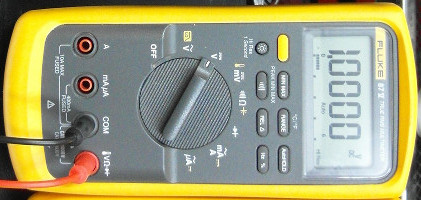

# Mittaustekniikka kevät 2016

Tällä kurssilla opimme mittaamaan elektroniikassa (ja sähköopissa) olennaisia suureita käyttäen erinäisiä mittalaitteita, sekä teoriaa kyseisten suureiden mittaamisen pohjalla. Huomaa, että käymme läpi vain pienen osan suureista ja mittaustavoista; esimerkiksi kompleksilukujen käyttöä vaihtovirtasuureiden mittauksessa ja mallinnuksessa ei käsitellä.

### Käytetyt mittalaitteet

**Yleismittari**

*Kuvien lähteet*

Yleismittari: [Binarysequence](https://en.wikipedia.org/wiki/Multimeter#/media/File:Fluke87-V_Multimeter.jpg)