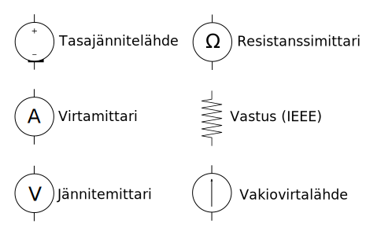

# Jännite, virta ja resistanssi

*Käytetyt symbolit*

Sähkövirta (symboli *I* ja yksikkö A *ampeeri*) on varauksen siirtymistä
paikasta toiseen. Kahden pisteen välille syntyvää virtaa varten tulee olla
sekä pisteissä olevien **varauksien eron** aiheuttama jännite (*U*, yksikkö
V *voltti*), että johdin, jota pitkin virta kulkee. Johtamiskykyä kuvataan
yleensä resistanssilla (*R*, yksikkö &#8486; *ohmi*), joka on sitä pienempi,
mitä paremmin johdin johtaa sähköä. Eristeillä on siis suuri resistanssi,
ja johtimilla pieni resistanssi. Nämä kolme suuretta ovat siis toisistaan
riippuvaisia seuraavan yhtälön eli **Ohmin lain** mukaan:

$$
U = RI
$$

Yleismittarilla voi mitata kaikkia näistä kolmesta suureesta. Virtaa
mitattaessa mittari kytketään **sarjaan** osaksi mitattavaa piiriä, ja
jännitettä mitattaessa **rinnakkain** mitattavan piirin kanssa. Tämän vuoksi
yleismittarissa on erilliset liitännät virta- ja jännitemittauksia varten.
Virtaa mitattaessa yleismittarilla on pieni resistanssi, joten se käyttäytyy
kuin oikosulku. Jännitettä mitattaessa resistanssi on suuri, joten mittari
vaikuttaa piirin käytökseen kuin avoin piiri.

*Yleismittarin sijaiskytkentä*

Ole tarkkana virtamittauksien
kanssa! Jos mittari kytketään väärin virtaa mitattaessa, mitattava piiri voi
helposti tuhoutua ja yleismittarin sulake palaa. Jännitemittauksissa riski on
yleensä pienempi. Resistanssimittauksen yhteydessä mitattavasta piiristä
kannattaa kytkeä virta pois, jotta se ei pääse tuhoamaan mittaria tai
vaikuttamaan mittaustulokseen.

| Mittaustila | Symboli |
| ----------- | ------- |
| Jännite     | V       |
| Virta       | I       |
| Resistanssi | &#8486; |

*Yleismittarin tilat*

Yleismittarin valintakiekolla valitaan sekä mittaustila että mittausalue. Jos
mitattavan arvon suuruusluokkaa ei tiedä, kannattaa valita aluksi suurempi
arvoalue, ja alkaa pienentää sitä, kunnes arvo näkyy mittarin ruudulla.
Mittausalue ilmoitetaan yleensä metrisin etuliittein (m, k, M), jotka on
lueteltu oheisessa taulukossa.

| Etuliite    | Symboli    | Arvo                |
| ----------- | ---------- | ------------------- |
| piko        | p          | 0,000 000 000 000 1 |
| nano        | n          | 0,000 000 000 1     |
| mikro       | &micro;, u | 0,000 000 1         |
| milli       | m          | 0,000 1             |
| kilo        | k          | 1 000               |
| mega        | M          | 1 000 000           |
| giga        | G          | 1 000 000 000       |

*Elektroniikassa käytetyt etuliitteet*

Tehtävää 1 varten tarvitset yleismittarin lisäksi jännitelähteen/vakiovirtalähteen
sekä vastuksia. Hacklabilla olevat laboratoriovirtalähteet toimivat
sekä jännitelähteinä että vakiovirtalähteinä. Jos virtanupin (*current*)
kääntää maksimiasentoonsa, voi jännitenupilla säätää jännitteen haluamakseen,
jolloin lähde toimii jännitelähteenä. Jos taas jännitenupin (*voltage*) kääntää
maksimiin, niin virtanupilla voi säätää virran, jolloin lähde toimii
vakiovirtalähteenä. Huomaa, että virta tai jännite pysyy vakiona vain laitteen
asettamissa rajoissa, esim. lähteen napojen ollessa auki jännite ei ole ääretön.

*Tehtävä 1: täydennä taulukko mittaamalla ja laskemalla*

Arkielämässä ainoa suora kontaktimme sähkön kanssa on sähköisku, joten ihmiselle
jännite, virta ja resistanssi eivät ole sinänsä merkityksellisiä asioita.
Moni muu fysikaalinen suure sen sijaan on: äänenpaine, valo, lämpötila, kosteus,
nopeus... Kaikki nämä voidaan muuttaa sähköisiksi signaaleiksi, jotka ovat *analogisia*
alkuperäisen suureen kanssa &mdash; siitä nimitys *analogielektroniikka*.
Kun suure on muutettu sähköiseksi signaaliksi, sitä on helppo tarkastella elektronisilla
mittalaitteilla. Tehtävässä 2 rakennamme yksinkertaisen valosensorin, jolla voimme
tarkastella valon voimakkuutta yleismittarilla.

