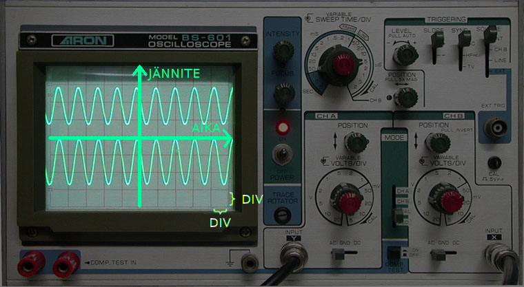
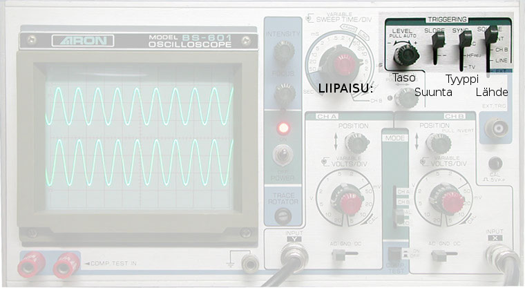
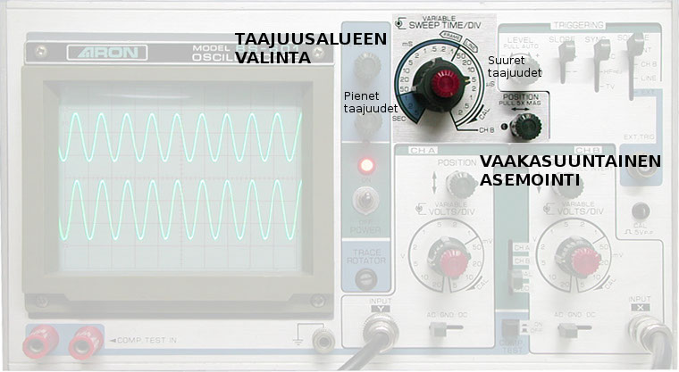
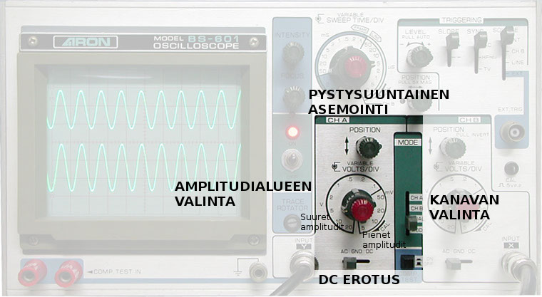
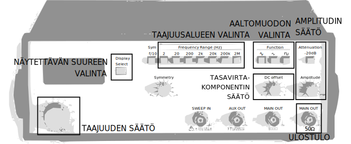
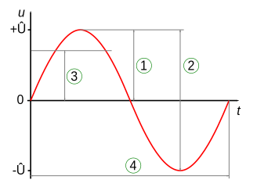
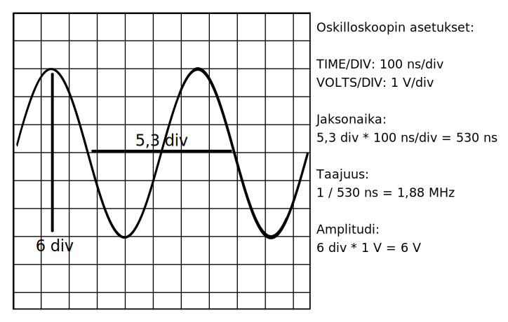

# Amplitudi, taajuus ja jaksonaika

*Kuva 2.1. Oskilloskoopin kuvaputki*

Yleismittarilla voidaan tutkia hitaasti muuttuvia signaaleja, mutta kun
signaali muuttuu satoja, tuhansia tai miljoonia kertoja sekunnissa, tarvitaan
*oskilloskooppia*. Oskilloskoopilla voidaan piirtää jännitteen vaihtelu ajan
suhteen ruudulle (*kuva 2.1*). Aloittakaamme tutustumalla oskilloskooppiin.

**Tehtävä 2.1:** *Kytke funktiogeneraattorin MAIN OUT oskilloskoopin
kanavaan 1. Yritä saada signaali näkymään ruudulla.*

*Kuva 2.2. Liipaisusäätimet*

Tehtävää 2.1 varten oskilloskoopin liipaisu (*trigger*) sekä amplitudi-
ja taajuusalueet tulee säätää kohdilleen. Aloita kääntämällä
liipaisutasonuppia (*kuva 2.2*) edestakaisin, kunnes signaali on näkyvissä ja
paikallaan. **HUOM:** varmista, että oskilloskoopissa on valittuna oikea
kanava (*ks. kuva 2.4*), ja että sama kanava on myös liipaisulähteenä
(*source*). Lisäksi kannattaa panna triggeröinti auto-tilaan, jolloin signaali
on näkyvissä vaikka liipaisua ei tapahtuisi.

*Kuva 2.3. Pyyhkäisysäätimet*

Säädä seuraavaksi taajuusalue kohdilleen pyörittämällä taajuusalueen
valintanuppia (*kuva 2.3*). Nupin *TIME/DIV*-teksti tarkoittaa sitä ajanjaksoa,
jota yksi oskilloskoopin näytön viivaväli (*kuva 2.1*) vastaa. Jos
signaali näyttää vaakasuoralta viivalta, käännä nuppia vastapäivään
(kohti pienempiä taajuuksia); jos se liikkuu ylösalaisin niin nopeasti,
että se muodostaa palkin, käännä nuppia myötäpäivään. Jos signaali on
vieläkin vaakasuora viiva, on amplitudialue todennäköisesti väärä &mdash;
käymme sen läpi seuraavaksi.

*Kuva 2.4. Kanavasäätimet*

Amplitudialueen valinta tapahtuu siihen tarkoitetulla nupilla (*kuva 2.4*).
Nupin yhteydessä oleva teksti *VOLTS/DIV* tarkoittaa sitä jännite-eroa,
jota yksi viivaväli oskilloskoopin ruudulla vastaa.  Jos signaali
näyttää suoralta viivalta, on amplitudialue liian suuri, joten käännä
nuppia myötäpäivään. Jos signaali leikkautuu ylä- ja alareunoihin,
on alue liian pieni, joten nuppia käännetään vastapäivään. Kanavan
valintasäätimellä voidaan valita ruudulla näytettävä kanava (tai kanavat);
tässä tehtävässä käytämme kanavaa A. DC-erotus &ndash;säätimellä
voidaan suodattaa tasavirtakomponentti pois signaalista, jolloin signaalia ei
tarvitse erikseen käsin asemoida.

*Kuva 2.5. Funktiogeneraattori*

**Tehtävä 2.2:** *Aseta funktiogeneraattorin (kuva 2.5) taajuudeksi
(frequency) 1MHz ja peak-to-peak amplitudiksi (amplitude) 1V käyttäen
generaattorin säätimiä ja näyttöä. Käytä aaltomuotona siniaaltoa
(&#8767;). Tarkista arvot mittaamalla ne oskilloskoopilla.*

**Taajuus** kuvaa signaalin jaksojen ajallista tiheyttä - suuritaajuuksisessa
signaalissa on enemmän jaksoja samalla aikajaksolla kuin pienitaajuuksisessa
signaalissa. Taajuuden yksikkö on hertsi (*Hz*), joka on sekunnin käänteisluku
(*1/s*). Taajuuden symboli on yleensä *f*.

**Jaksonaika** kuvaa signaalin yksittäisen jakson kestoa. Sen perusyksikkö on
sekunti (*s*). Jaksonaika ja taajuus kuvaavat samaa asiaa, mutta ovat toistensa
käänteislukuja - suuri jaksonaika tarkoittaa pientä taajuutta ja toisinpäin
(*t = 1/f*). Jaksonajan symboli on yleensä *t*, sama kuin ajan symboli.

**Amplitudi** kuvaa värähtelyjen laajuutta, eli jännitesignaalin tapauksessa
jännitteen vaihteluväliä. Amplitudisuureita on useita: *huipusta
huippuun-amplitudi* on suurimman ja pienimmän jännitearvon välinen erotus, ja
sitä käytämme eniten tällä kurssilla. Muut suureet ovat *huippuamplitudi*, joka
on jännitteen suurin arvo, sekä *tehollinen amplitudi*, joka kuvaa signaalin
välittämän tehon määrää. Jännitesignaalin tapauksessa amplitudisuureiden yksikkö
on voltti (*V*). Huipusta-huippuun amplitudin symboli on jännitesignaalien
tapauksessa yleensä *V&#8346;&#8331;&#8346;* ja huippuamplitudin symboli
*V&#8346;*.

*Kuva 2.6. Suureet graafisesti kuvattuna*

| Suure                             | Englanniksi           | Yksikkö       |
| --------------------------------- | --------------------- | --------------|
| Taajuus                           | Frequency             | Hertsi (*Hz*) |
| Jaksonaika &#8308;                | Period                | Sekunti (*s*) |
| Huipusta huippuun-amplitudi &sup2;| Peak-to-peak amplitude| Voltti (*V*) &#8309;|
| Huippuamplitudi &sup1;            | Peak amplitude        | Voltti (*V*) &#8309;|

> *1,2,4) katso kuva 2.6*                                                    
> *5) jännitesignaalien tapauksessa*

*Taulukko 2.1. Muutamia suureita*

**Amplitudin, taajuuden ja jaksonajan mittaaminen oskilloskoopilla.** Ko.
suureiden mittaamiseen oskilloskoopilla tarvitaan sekä oskilloskoopin ruudulla
näkyvä kuva että *TIME/DIV* ja *VOLTS/DIV* asetukset. Mittaus tapahtuu
seuraavasti (*kuva 2.7*):

1. Säädä oskilloskooppi siten, että vähintään yksi jakso näkyy selvästi
   kokonaisuudessaan ruudulla.
2. Laske **vaakasuuntaisten** viivavälien (*DIV*) lukumäärä kahden samassa
   kohdassa jaksoa olevan pisteen välissä. Pisteinä voivat olla esimerkiksi
   huiput tai jakson alkukohdat. Huomaa, että viivavälien määrän ei tarvitse
   olla kokonaisluku - esimerkiksi 3,3 viivaväliä on täysin järkevä arvo.
3. Kerro tämä luku oskilloskoopin *TIME/DIV* arvolla, jolloin saat jaksonajan.
4. Laske jaksonajan käänteisluku **yksiköt huomioiden**. Näin saat taajuuden.
5. Laske **pystysuuntaisten** viivavälien lukumäärä signaalin korkeimman ja
   matalimman kohdan välillä.
6. Kerro tämä luku oskilloskoopin *VOLTS/DIV* arvolla. Näin saat huipusta
   huippuun-amplitudin.

*Kuva 2.7. Suureiden mittaaminen oskilloskoopilla*

**Tehtävä 2.3:** opettaja säätää funktiogeneraattorien asetukset ja peittää
generaattorit paperilapulla. Mittaa signaaleista amplitudi, taajuus ja
jaksonaika.

| Amplitudi | Jaksonaika | Taajuus |
| --------- | ---------- | ------- |
| &nbsp;    | &nbsp;     | &nbsp;  |
| &nbsp;    | &nbsp;     | &nbsp;  |
| &nbsp;    | &nbsp;     | &nbsp;  |

**Tehtävä 2.4:** kytke *Mystinen Signaalilähde&trade;* oskilloskooppiin ja
tulkitse sen tuottamat signaalit. Käytä oskilloskoopin DC-asentoa.  Signaalia voi
vaihtaa nappia painamalla.  Käytä apuna kuvaa 2.8.

<table>
<thead>
<tr><th style="width: 10%;">Morse/binääri</th><th>Tulkinta</th></tr>
</thead>
<tbody>
<tr><td>&nbsp;</td><td>&nbsp;</td></tr>
<tr><td>&nbsp;</td><td>&nbsp;</td></tr>
<tr><td>&nbsp;</td><td>&nbsp;</td></tr>
<tr><td>&nbsp;</td><td>&nbsp;</td></tr>
</tbody>
</table>

Jos signaalin saa näkymään ruudulle, voi sen sisällöstä tulkita monia seikkoja
myös kvalitatiivisesti &mdash; aaltomuodon, mahdollisen modulaatiotavan (AM/FM),
digitaalisen signaalin koodauksen (Manchester, 8b/10b, jne..), ja lukemattomia
muita ominaisuuksia. Tehtävässä 2.4 tarkastellaan signaaleja oskilloskoopilla
ja tulkitaan niiden sisältöä.

*Kuva 2.8. Morseaakkoset ja binääriluvut*
