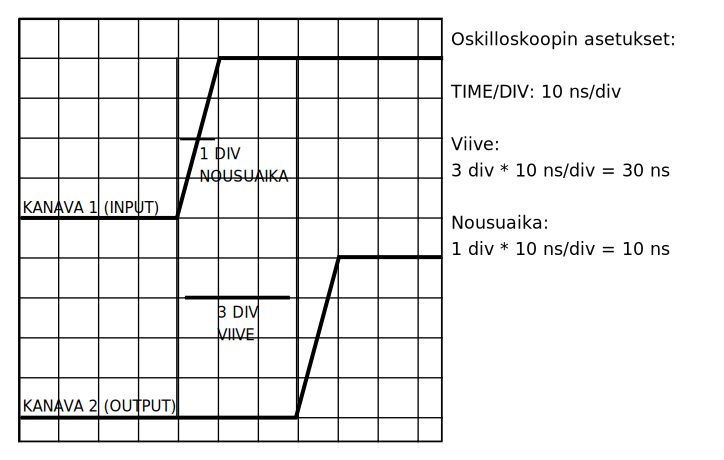

# Tasavirtakomponentti, viive ja nousuaika

**Tehtävä 3.1:** Aseta oskilloskoopi AC-tilaan ja kytke se eri
tasajännitelähteisiin. Mittaa amplitudi.

| Lähdejännite | Häiriöiden *V&#8346;&#8331;&#8346;* | Suhteellinen ero |
| ------------ | ----------------------------------- | ---------------- |
| &nbsp;       | &nbsp;                              | &nbsp;           |
| &nbsp;       | &nbsp;                              | &nbsp;           |
| &nbsp;       | &nbsp;                              | &nbsp;           |

Sähkövirta voidaan jakaa muuttumattomaan *tasavirtaan* (AC) että jaksollisesti
muuttuvaan *vaihtovirtaan* (DC). Usein, varsinkin elektroniikassa, esiintyy
molempia samassa signaalissa. Oskilloskoopin AC-erotus *(coupling)* mahdollistaa
vaihtovirtakomponentin tarkastelemisen erillään tasavirtakomponentista, jolloin
suurikaan vaihtovirta ei häiritse tasavirtamittausta. Jännitelähteen tapauksessa
tasavirta kuvaa itse lähdejännitettä, ja vaihtovirta kuvaa jännitteessä
näkyviä *häiriöitä*. Matemaattisesti tarkasteltuna tasavirta&ndash eli
DC-komponentti tarkoittaa signaalin keskiarvoa.

**Tehtävä 3.2:** Kytke funktiogeneraattori oskilloskooppiin ja mittaa
tasavirtakomponentin suuruus.

| Alahuipun jännite | Ylähuipun jännite | DC-komponentti |
| ----------------- | ----------------- | -------------- |
| &nbsp;            | &nbsp;            | &nbsp;         |
| &nbsp;            | &nbsp;            | &nbsp;         |
| &nbsp;            | &nbsp;            | &nbsp;         |

**Siniaallon (ja muiden symmetristen aaltomuotojen) tasavirtakomponentin
mittaaminen.** Koska sinisignaali on symmetristä, sen keskiarvo on 0. Näin ollen
sinisignaalin ja tasavirtakomponentin yhdistelmän tapauksessa
tasavirtakomponentin arvo on yksinkertaisesti huippuarvojen keskiarvo.
Huippuarvoja ovat signaalin jännitteen pienin arvo (alahuippu) sekä suurin arvo
(ylähuippu).

*Kuva 3.1. Mittauskytkentä viiveen ja nousuajan mittausta varten.*

Usein haluamme mitata, miten signaali kulkee jonkin piirin läpi.
Piiri voi olla esim. suodatin, vahvistin, digitaalinen piiri tai vaikka pelkkä
johdin. Mittauksia varten meidän pitää tietää sekä piiriin menevä signaali
(*input, otto*) että piiristä ulos tuleva signaali (*output, anto*). Tätä varten
melkein kaikissa oskilloskoopeissa on vähintään kaksi kanavaa. Jos yhteen
kanavaan panee inputin ja toiseen kanavaan panee outputin, on signaaleja helppo
vertailla keskenään. Yksi tällä tavalla mitattavista asioista on viive, eli se
aika, joka signaalilla kestää kulkea piirin läpi.

*Kuva 3.2. Viiveen ja nousuajan mittaus*

**Viiveen ja nousuajan mittaaminen oskilloskoopilla.** Viivettä ja nousuaikaa
voi mitata oskilloskoopilla viivavälejä mitaten, kuten aiemmassakin luvussa.
Tarvitset oskilloskoopin ruudulla näkyvän si

1.  Kytke oskilloskooppi mitattavan piirin kanssa rinnakkain (*kuva 3.1.*),
    siten, että piirin input on kanavassa A, ja piirin output on kanavassa B.
    Monissa funktiogeneraattoreissa on kaksi tai useampia outputteja, joten
    toisen outputin voi kytkeä mitattavaan piiriin ja toisen oskilloskooppiin.
2.  Asemoi signaalit *POSITION*-nupin avulla siten, että ne näkyvät molemmat
    selkeästi ruudulla.
3.  Laske vaakasuuntaisten viivavälien lukumäärä kanavan A sen kohdan välillä,
    missä signaali lähtee nousemaan, sekä kanavan B sen kohdan välillä, missä
    signaali lähtee nousemaan. Kerro tämä luku oskilloskoopin *TIME/DIV*
    arvolla, jolloin saat piirin viiveen (*kuva 3.2.*).
4.  Nousuaika voidaan laskea signaaleista *erikseen*, siihen tarvitsee siis
    vain yhden signaalin. Mittaa viivavälien lukumäärä nousevan reunan alun ja
    lopun välillä. Kerro tämä oskilloskoopin *TIME/DIV*-arvolla, jolloin saat
    nousuajan arvon.

**Tehtävä 3.3. Mittaa eri funktiogeneraattorien nousuaikoja ja eri johtimien ja
piirien viiveitä. Aseta funktiogeneraattori tuottamaan kanttiaaltoa. Merkitse
tulokset taulukkoon.**

| Funktiogeneraattori | Nousuaika |
| ------------------- | --------- |
| &nbsp;              | &nbsp;    |
| &nbsp;              | &nbsp;    |
| &nbsp;              | &nbsp;    |

| Piiri tai johdin    | Viive     |
| ------------------- | --------- |
| &nbsp;              | &nbsp;    |
| &nbsp;              | &nbsp;    |
| &nbsp;              | &nbsp;    |
